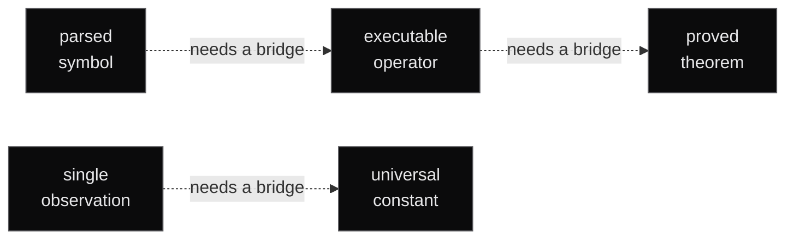
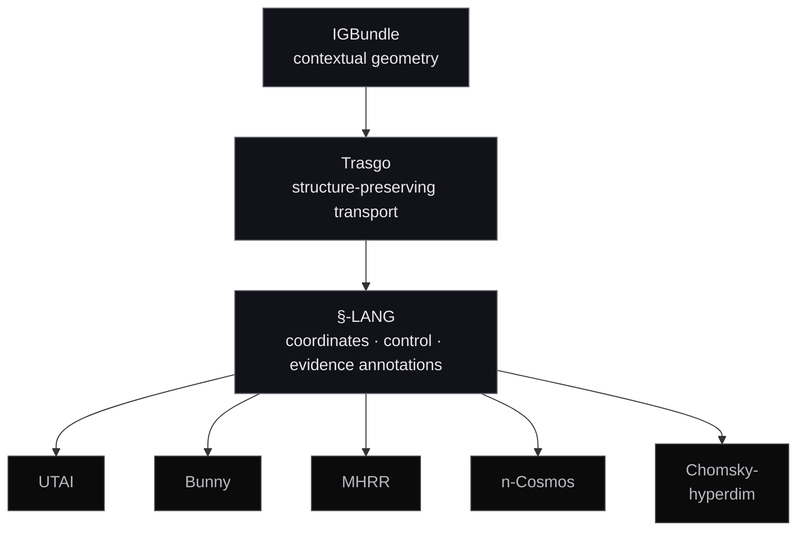
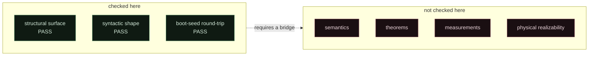
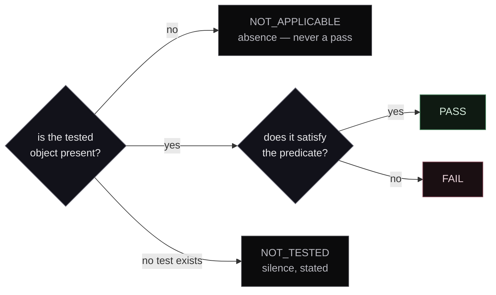
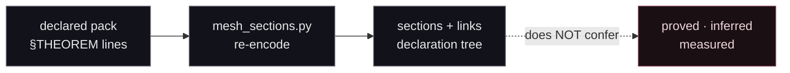

# §-LANG


A specification-first research language for geometric, computational, and
formal structure over contextual manifolds.

Built on one rule.

---

## 間 — the gap

Between what a system says and what it has shown, there is a gap.

Most research code closes it quietly. This one keeps it open, names it, and
puts it under test.



Every dotted arrow is a promotion someone has to earn. None of them fire on
their own.

A symbol that parses is not an operator that runs.
An operator that runs is not a theorem that holds.
One measurement is not a constant.
An architecture is not a result.

Everything below follows from that.

---

## Layers



The programmes are sections of the stack, not conclusions of it. Being
expressible in §-LANG grants an artifact no authority.

---

## What holds, and how far



| Layer | State | Authority |
|---|---|---|
| Symbolic language sources | available | specification / semantic |
| Block and section validation | implemented | structural only |
| Chomsky surface-shape checks | implemented | syntactic only |
| Pack surfaces | implemented | header + identity only |
| Reference runtime | reported surface | see [`RUNTIME_CAPABILITIES.md`](RUNTIME_CAPABILITIES.md) |
| Lean / Bunny results | external | needs a pinned proof artifact |
| R142 / MHRR numerics | observations | needs data, method, uncertainty, provenance |
| UTAI / n-Cosmos | programme | architectural unless separately evidenced |

---

## Run it

```bash
python3 -m pip install -r requirements.txt

python3 -m unittest discover -s tests -p 'test_*.py'
python3 tools/validate_typecast.py --all
python3 tools/validate_typecast.py
python3 tools/verify_chomsky.py
python3 tools/stego_boot_banner.py --verify figures/slang_boot_banner.png
```

Pillow is the only third-party dependency, needed by the banner tool alone.
Everything else is standard library.

### Four statuses, not two



An empty file passing every check is the failure mode this design exists to
prevent. Absence reports as absence.

Each source is validated against the profile declared for it in
[`validation/sources.json`](validation/sources.json). Profiles are never
inferred from filenames; an undeclared surface fails rather than defaulting, a
declared source that is missing fails rather than being skipped, and a pack
cannot stand in for another pack — its declared `§PACK` identity is bound to its
profile.

The reports under `research/` are committed and diffed in CI. A committed report
the tooling would not reproduce is not evidence.

---

## Sources

Thirteen sources, all declared, all validated.

**Language family** — `LANG.v1.2.0.unified_geometry` · `DIALECTS.v2.1.family` ·
`LANG.v2.5.tower.geom` · `LANG.v3.0.substrate_realization` ·
`LANG.v3.1.recursive_sectional_computer` · `LANG.v3.2.actor_critic_fuzzer_cycle` ·
`LANG.v5.topos_ai_cosmos_synthesis` · `LANG.v6.chomsky_hyperdim_cognition`

**Packs** — `MHRR_PM_Hypercomplex_Orthogonal` · `principia_seed` ·
`principia_mathematica_full_N400` · `principia_360_prime_orthogonal` ·
`ncosmo_hypercomplex_unification`

A version belongs to its named source. A pack version is not a new version of
the core language.

The packs are generator output totalling ~19 MB, 3,871 `§THEOREM` declarations
and 3,875 `⊢ COMMIT` markers. **A `⊢` in a pack is a character the generator
emitted, not a judgment a checker discharged.** See [`PACKS.md`](PACKS.md) — it
documents each pack, its real structure, and the bridges each would need.

### Meshes

A declared pack projects into the section/link topology its declarations imply:

```bash
python3 tools/mesh_sections.py principia_360_prime_orthogonal.lang \
  --out research/mesh/principia_360_prime_orthogonal.mesh.json
```



| Pack | Sections | Links | Depths | Primes |
|---|---:|---:|---:|---:|
| `principia_360_prime_orthogonal` | 1800 | 1795 | 360 | 360 |
| `principia_mathematica_full_N400` | 2000 | 1995 | 400 | — |
| `ncosmo_hypercomplex_unification` | 70 | 63 | 10 | 70 |

Links are fewer than `sections − 1` because each pack is a **forest, not a
tree** — the five PM axioms at depth 1 are roots with no parent, and the
n-Cosmos pack roots once per cosmos level. A viewer expecting a single spanning
tree will mis-draw these.

A section is a declaration, a link is adjacency in the declaration tree, and the
coordinates are values the pack states. Projection re-encodes; it never
promotes. Only manifest-declared pack surfaces may be projected — the tool
refuses anything else.

---

## The boot seed

The banner carries an LSB-steganographic payload of its own source seed:

```bash
python3 tools/stego_boot_banner.py --verify figures/slang_boot_banner.png
```

CI runs this decode on every build. It is a **steganographic
self-reconstruction witness** — a quine-like fixed point over encode/decode,
accepted as `SLANG-BOOT-001`.

It is not a proof of Löb's theorem. That reading is retired as
`RETIRED-LOEB-001`; promotion would need a formal theory, a provability
predicate, the derivability conditions, a proposition, and a checked proof.

The decoded payload contains the tokens `Löb` and `executable`. Those are
strings inside the artifact, not findings about it.

---

## Documents

| | |
|---|---|
| [`STATUS.md`](STATUS.md) | publication gates · evidence tags · stop rule |
| [`CLAIMS.yaml`](CLAIMS.yaml) | claim → artifact ledger |
| [`VERIFICATION.md`](VERIFICATION.md) | what is and is not verified |
| [`PACKS.md`](PACKS.md) | the five generated packs |
| [`MODULES.md`](MODULES.md) | Σ∞ module registry · notation · honest frontier |
| [`CANDIDATES.md`](CANDIDATES.md) | external material evaluated but not imported |
| [`RUNTIME_CAPABILITIES.md`](RUNTIME_CAPABILITIES.md) | reported runtime surface |
| [`THESIS.md`](THESIS.md) | programme narrative · theorem targets (`S`/`H`) |
| [`SKILL.md`](SKILL.md) | operational workflow |
| [`validation/sources.json`](validation/sources.json) | the validated set |

Evidence tags: `P` proved · `A` assumed · `M` measured · `H` hypothesis ·
`S` semantic · `R` retired. Defined in [`STATUS.md`](STATUS.md). Not a ladder.

---

## Where this stands

Not a self-contained publication-ready implementation. Not a formally verified
system. The defensible claim is narrower, and it is the one being made:

> §-LANG is an evidence-governed symbolic research language programme with
> structural validation tooling and experimental geometric research packs.

Next target: a bounded §-LANG Core — grammar, independent parser, minimal
evaluator with known-answer and metamorphic tests, conformance suite, and
claim-specific formal or empirical artifacts.

For contributors, the shape of a useful contribution is narrow and specific:
close a bridge in [`CLAIMS.yaml`](CLAIMS.yaml), or write the checker that makes
a `⊢` mean something.

---

## License

Copyright © Jesús Vilela Jato, 2026. All rights reserved.

**No reuse license is currently granted.** Reuse requires explicit permission.
An explicit license and `CITATION.cff` are open publication gates tracked in
[`STATUS.md`](STATUS.md).
