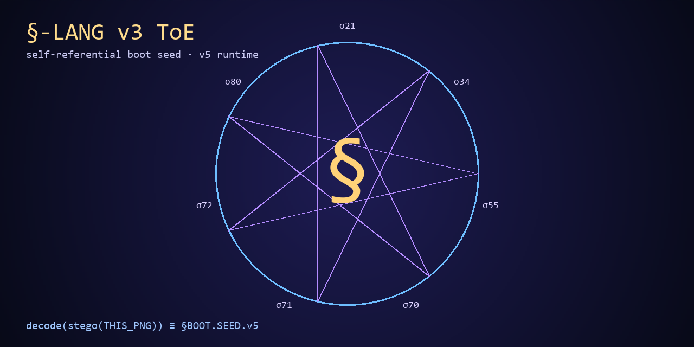

# §-LANG — Evidence-Governed Geometric Research Language



§-LANG is a **specification-first research language** for expressing geometric,
computational, semantic, and formal structures across contextual manifolds.
It combines a symbolic language surface with structural validation tools,
experimental dialect packs, and downstream research programmes.

The project is intentionally ambitious, but evidence authority is stratified:

- a parsed symbol is not automatically an executable operator;
- an executable operator is not automatically a proved theorem;
- a numerical observation is not automatically universal;
- a semantic or architectural construct is not automatically an external scientific result.

See [`STATUS.md`](STATUS.md), [`CLAIMS.yaml`](CLAIMS.yaml), and
[`VERIFICATION.md`](VERIFICATION.md) before relying on a strong claim.

## Root architecture

The repository is organized conceptually as:

```text
IGBundle contextual geometry
  -> Trasgo structure-preserving transport
  -> §-LANG coordinates, control, and evidence annotations
  -> sectional programmes: UTAI, Bunny, MHRR, n-Cosmos, Chomsky-hyperdim
```

The downstream programmes are research sections of the stack. Their presence in
this repository does **not** imply that every associated theorem, runtime claim,
or empirical interpretation has been independently verified.

## Current capability boundary

| Layer | Current status | Evidence authority |
|---|---|---|
| Symbolic language sources | Available | Specification / semantic |
| Legacy block and section validation | Implemented | Structural only |
| Chomsky surface-shape checks | Implemented | Syntactic evidence only |
| Reference runtime | Reported capability surface; provenance varies by component | Consult `RUNTIME_CAPABILITIES.md` |
| Lean/Bunny results | Claim-specific and potentially external | Require a pinned proof artifact |
| R142/MHRR numerical results | Research observations | Require data, method, uncertainty, and execution provenance |
| UTAI / n-Cosmos architecture | Experimental programme | Architectural / hypothesis unless separately evidenced |

## Canonical sources and experimental packs

[`validation/sources.json`](validation/sources.json) is the authoritative list of
sources under structural validation. Every entry must exist; a declared source
that is missing fails the build rather than being skipped.

- `LANG.v1.2.0.unified_geometry.lang`
- `DIALECTS.v2.1.family.lang`
- `LANG.v2.5.tower.geom.lang`
- `LANG.v3.0.substrate_realization.lang`
- `LANG.v3.1.recursive_sectional_computer.lang`
- `LANG.v3.2.actor_critic_fuzzer_cycle.lang`
- `LANG.v5.topos_ai_cosmos_synthesis.lang`
- `LANG.v6.chomsky_hyperdim_cognition.lang`
- `MHRR_PM_Hypercomplex_Orthogonal.lang` — experimental R142/MHRR pack

Version numbers belong to their named source or pack. A pack version is not
implicitly a new version of the core language specification.

### Undeclared bulk artifacts

The repository also carries large generated `.lang` artifacts that are **not**
in the validated set and carry **no structural evidence status**:

- `principia_360_prime_orthogonal.lang` (~11 MB)
- `principia_mathematica_full_N400.lang` (~8 MB)
- `ncosmo_hypercomplex_unification.lang`
- `principia_seed.lang`

They are retained as research material. No check in this repository parses,
validates, or reproduces them, and nothing in them should be read as evidence
for any claim in `CLAIMS.yaml`.

## Validation

Install the pinned tooling dependencies once, then run the bounded structural
checks:

```bash
python3 -m pip install -r requirements.txt

python3 -m unittest discover -s tests -p 'test_*.py'
python3 tools/validate_typecast.py --all
python3 tools/validate_typecast.py
python3 tools/verify_chomsky.py
python3 tools/stego_boot_banner.py --verify figures/slang_boot_banner.png
```

Only `tools/stego_boot_banner.py` needs a third-party dependency (Pillow); the
other tools are standard-library only.

The generated reports under `research/` are committed, and CI fails if they drift
from what the current tooling produces — a committed report that the tooling
would not reproduce is stale evidence, not evidence. Re-run the commands above
and commit the result whenever a validated source or a tool changes.

`tools/validate_typecast.py` now distinguishes:

- `PASS` — the tested property is present and satisfied;
- `FAIL` — the tested property is present or required and violated;
- `NOT_APPLICABLE` — the file contains no object to which the property applies;
- `NOT_TESTED` — the validator has no implemented test for that semantic level.

Validation sources are declared in `validation/sources.json`. Unknown source
surfaces fail explicitly instead of silently inheriting a profile from a filename.

These checks do **not** prove semantic correctness, mathematical theorems,
physical realizability, or external scientific relevance.

## Self-referential boot seed

The banner contains an LSB-steganographic payload that can be recovered with
(requires Pillow, see `requirements.txt`):

```bash
python3 tools/stego_boot_banner.py --verify figures/slang_boot_banner.png
```

This is currently classified as a **steganographic self-reconstruction witness**
or quine-like fixed-point artifact — the accepted claim is `SLANG-BOOT-001`, and
CI runs this decode on every build. It is not, by itself, a formal proof of
Löb's theorem. Promotion to a Löb result would require a formal theory,
provability predicate, derivability conditions, proposition, and checked proof.
The earlier Löb reading is retired as `RETIRED-LOEB-001`.

Note that the decoded payload is itself §-LANG source text and contains tokens
such as `Löb` and `executable`. Those are strings inside the artifact, not
findings about it.

## UTAI and sectional programmes

UTAI, Bunny, MHRR, the Hamiltonian n-Cosmos, visualization systems, Android
substrates, and LLM-facing tendrils remain preserved as experimental sections.
Their artifacts should carry their own evidence status and must not inherit
execution or proof authority merely from being expressible in §-LANG.

## Research documents

- [`THESIS.md`](THESIS.md) — programme narrative and theorem targets (`S`/`H`)
- [`VERIFICATION.md`](VERIFICATION.md) — verified and unverified boundaries
- [`RUNTIME_CAPABILITIES.md`](RUNTIME_CAPABILITIES.md) — reported runtime surface
- [`STATUS.md`](STATUS.md) — present publication and reproducibility status
- [`CLAIMS.yaml`](CLAIMS.yaml) — claim-to-artifact ledger
- [`SKILL.md`](SKILL.md) — operational workflow over the validated sources
- [`validation/sources.json`](validation/sources.json) — authoritative validated source set

## Publication status

The repository is **not yet presented as a self-contained publication-ready
implementation or formally verified system**. The currently defensible release
claim is narrower:

> §-LANG is an evidence-governed symbolic research language programme with
> structural validation tooling and experimental geometric research packs.

The next publication target is a bounded §-LANG Core specification with a
parser, evidence-aware validator, conformance tests, reproducible examples, and
claim-specific formal or empirical artifacts.

## License and citation

Copyright © Jesús Vilela Jato, 2026. All rights reserved unless a more specific
license file is added. Reuse therefore requires explicit permission.

Citation metadata and an explicit reuse license remain publication gates tracked
in `STATUS.md`.
